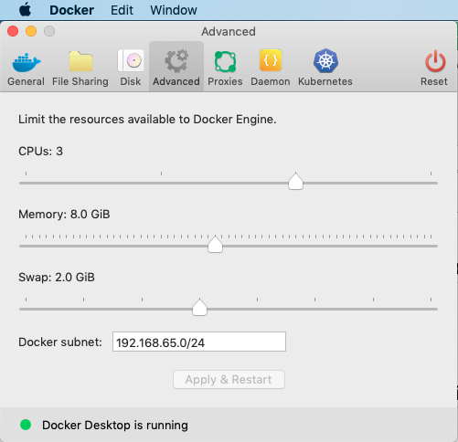

# Running GrimoireLab with docker-compose

This folder host configuration files to run GrimoireLab using 
[docker-compose](https://docs.docker.com/compose/), one of the 
easiest way to get started with GrimoireLab.

# Requirements

* A [Git](https://git-scm.com/) client
* [Docker Engine](https://docs.docker.com/install/) and [Docker Compose](https://docs.docker.com/compose/install/)
* Recommended, at least, 2CPUs, 8GB memory RAM, and 2GB SWAP (MacOS users can manage it with [Docker client for Mac](https://hub.docker.com/editions/community/docker-ce-desktop-mac))

For example, in one of my latest demos, I was using:
```console
root@qiskit-6fc71ea6:~# git --version
git version 2.17.1
root@qiskit-6fc71ea6:~# docker --version
Docker version 19.03.1, build 74b1e89
root@qiskit-6fc71ea6:~# docker-compose --version
docker-compose version 1.22.0, build f46880fe
root@qiskit-6fc71ea6:~# free
              total        used        free      shared  buff/cache   available
Mem:        8167996     3463652      128844        1440     4575500     4413328
Swap:             0           0           0
root@qiskit-6fc71ea6:~# du -hs /
du: cannot access '/proc/2234/task/2234/fd/4': No such file or directory
du: cannot access '/proc/2234/task/2234/fdinfo/4': No such file or directory
du: cannot access '/proc/2234/fd/3': No such file or directory
du: cannot access '/proc/2234/fdinfo/3': No such file or directory
26G     /
```
**Note**: `free` and `du` are Linux utilities to display amount of free and used 
memory in the system, and to estimate file space usage, respectively.

You should ensure [enough virtual memory for Elasticsearch](https://www.elastic.co/guide/en/elasticsearch/reference/current/vm-max-map-count.html) 
(one of GrimoireLab components). You can do it running the following command as `root` in Linux or as administrator user in MacOS:

## Linux
```console
sysctl -w vm.max_map_count=262144
```

## Mac
```
$ screen ~/Library/Containers/com.docker.docker/Data/vms/0/tty
(then run:) sysctl -w vm.max_map_count=262144
```

Remember also to assign proper resources to Docker through the UI. 8GB Memory and 2GB Swap should work.



# Getting started in 3 steps

1. Clone this project:
```console
git clone https://github.com/chaoss/grimoirelab
```

2. By default, this repository comes with some configuration files in [`default-grimoirelab-settings`](../default-grimoirelab-settings).
These files are the minimum set up to analyze git activity in this repository. If you want to analyze a different project with a different
set of repositories and data sources, you need to modify [`projects.json`](../default-grimoirelab-settings/projects.json) and
[`setup.cfg`](../default-grimoirelab-settings/setup.cfg) files. See [below](#more-information) more information about these files format.

3. Access to [`docker-compose`](./) folder and deploy GrimoireLab running this command:
```console
cd grimoirelab/docker-compose
docker-compose up -d
```

If everything goes well, data will be gathered and processed. To get access to
them, go to `http://localhost:8000/`

To manage contributors profile information with [SortingHat](https://github.com/chaoss/grimoirelab-sortinghat),
go to `http://localhost:8000/identities/`. To get access:
* User: `root`
* Pass: `root`

**Note**: you can change user and password in the `docker-compose.yml` file.

## Secured infrastructure

Deployed infrastructure following previous steps doesn't provide any security protection
on the data generated, so **don't use this for production environments or in public access environments**.

If you want to deploy this infrastructure with minimal security, use the *secured*
environment: 
* Edit [`default-grimoirelab-settings/setup-secured.cfg`](../default-grimoirelab-settings/setup-secured.cfg) to fit your needs
* Instead of the the regular `docker-compose.yml` file, we will use `docker-compose-secured.yml`:
```console
docker-compose -f docker-compose-secured.yml up -d
```

The difference is that it uses a secured Elasticsearch image and a secured Kibiter image.

To access to the dashboard would be the same as previously, but if you need to modify something, you would be 
asked to login.
* User: `admin`
* Password: `admin`

To change them, you need to enter in `elasticsearch` container and change [SearchGuard plugin](https://search-guard.com/) parameters.

## Opensearch

OpenSearch is an Open Source fork of Elasticsearch that includes additional
features and plugins. It has its own security plugin for authentication and
access control.

GrimoireLab works with OpenSearch, but panels are not automatically created,
but they can be manually imported.

If you want to deploy this infrastructure with minimal security, use the
`docker-compose-opensearch.yml` file:

```
docker-compose -f docker-compose-opensearch.yml up -d
```

To access to the dashboard would be the same as previously, but you would be
asked to log in:
* User: `admin`
* Password: `admin`

This version doesn't come with visualizations. You need to manually import the dashboards
from [Sigils repository](https://github.com/chaoss/grimoirelab-sigils/tree/main/panels/json/opensearch_dashboards)
or create your own.

For more information related with OpenSearch: https://opensearch.org/docs/latest/


# More information

* [The `projects.json` file format](https://github.com/chaoss/grimoirelab-sirmordred#projectsjson-)
* [The `setup.cfg` file format](https://github.com/chaoss/grimoirelab-sirmordred#setupcfg-)
* Getting API tokens for different services:
  * [GitHub](https://help.github.com/en/articles/creating-a-personal-access-token-for-the-command-line)
  * [GitLab](https://docs.gitlab.com/ee/user/profile/personal_access_tokens.html)
  * [Slack](https://get.slack.help/hc/en-us/articles/215770388-Create-and-regenerate-API-tokens)

## Common questions

### ElasticSearch container won't start up on Mac

Running the default `docker-compose.yml` in Mac caused issues with the provided
versions of Elasticsearch and Kibana. To resolve these problems, please use
the [OpenSearch version](#opensearch).


### How to stop and restart deployed software infrastructure?

There might be 2 potential scenarios:

1. If you want to do a simple configuration change and restart the platform:
```console
docker-compose restart
```
2. If you want to destroy current deployed configuration, and after some changes,
start from fresh one:
```console
docker-compose down
```
and once they are *down*:
```console
docker-compose up -d
```

If you are using the *secured* environment, remember that the command is different:
```console
docker-compose -f docker-compose-secured.yml up -d
```
